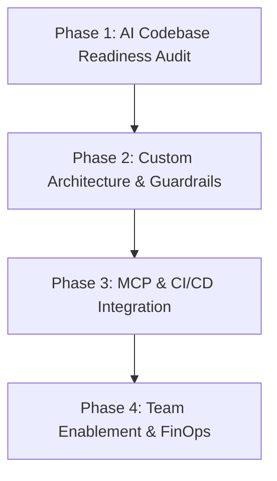

# Phase 8 & 9: LMS Content Production & Premium Certification Framework

**Program:** Claude Code Mastery: Zero to Production AI Engineer  
**Coverage:** LMS Content Architecture, Modular Lesson Blueprint, 3-Tier Certification System, and 6 Career Pathways

---

# PART 1: LMS Content Generation Framework (Phase 8)

To deliver this curriculum at world-class standards (comparable to Anthropic Internal Training, OpenAI Academy, and DeepLearning.AI), every lesson in the 60-day program must be produced using a standardized, 7-part content kit.

```
┌────────────────────────────────────────────────────────────────────────────────────────┐
│                          7-PART LESSON PRODUCTION COMPONENT KIT                         │
├───────────────────────────────┬────────────────────────────────────────────────────────┤
│ COMPONENT                     │ PRIMARY TARGET & FORMAT                                │
├───────────────────────────────┼────────────────────────────────────────────────────────┤
│ 1. Core Lesson Notes          │ Full comprehensive conceptual treatise (Markdown / LMS)│
│ 2. Instructor Lecture Guide   │ Timed talking points, live demo scripts & pitfalls     │
│ 3. Student Quick-Reference    │ 1-page printable / PDF cheat sheet                     │
│ 4. Slide Deck Outline         │ 10–15 slide structured presentation blueprint          │
│ 5. Autograded Quiz Bank       │ 5 conceptual / scenario questions with rationale       │
│ 6. Practical Coding Assignment│ Graded exercise with unit test validation suite        │
│ 7. Step-by-Step Lab Guide     │ Command-by-command hands-on terminal exercise          │
└───────────────────────────────┴────────────────────────────────────────────────────────┘
```

---

## 1. Master Lesson Production Blueprint Template

Every lesson in the curriculum is authored against this exact schema:

```markdown
<!-- LESSON MASTER TEMPLATE -->
# Lesson [Module].[LessonNumber]: [Lesson Title]

## Metadata
- **Track:** [Beginner | Intermediate | Advanced | Expert]
- **Duration:** [e.g., 45 Minutes]
- **Prerequisites:** [Prior Lesson / Tool requirements]
- **Core Primitives:** [e.g., Hooks, MCP, Context, Agent SDK]

---

## 1. Core Lesson Notes (Textbook Content)
### 1.1 Conceptual Deep-Dive
[Comprehensive conceptual breakdown with architectural explanations and why it matters.]

### 1.2 Under the Hood: Engine Mechanics
[Detailed explanation of how the Claude Code CLI, Agent SDK, or Anthropic API handles this internally.]

### 1.3 Production Best Practices & Antipatterns
- **Best Practice:** [Specific guideline with code example]
- **Antipattern:** [Common mistake and how to prevent it]

---

## 2. Instructor Lecture Guide & Live Demo Script
### 2.1 Timed Lecture Delivery (45 Minutes Total)
- **00:00 - 05:00:** Hook & Real-World Motivation
- **05:00 - 18:00:** Core Architecture & Syntax Walkthrough
- **18:00 - 32:00:** Live Terminal Demonstration (Terminal Screencast)
- **32:00 - 40:00:** Student Live Coding / Interactive Drill
- **40:00 - 45:00:** Q&A, Edge Cases & Common Pitfalls

### 2.2 Live Demo Script (Step-by-Step Terminal Commands)
```bash
# Command 1: Setup
claude --version
# Command 2: Execution
claude "prompt text"
```

### 2.3 Common Student Gotchas
1. *Symptom:* [e.g., Hook exits with status 1 instead of 2]  
   *Fix:* [Explain exact exit code protocol differences]

---

## 3. Student Quick-Reference (Cheat Sheet Card)
| Command / Syntax | Purpose | Example |
|---|---|---|
| `[Command]` | [Description] | `[Sample Usage]` |

**Key Takeaway:** [One-sentence memorable rule]

---

## 4. Slide Deck Outline (12 Slides)
- **Slide 1:** Title, Objectives & Real-World Value
- **Slide 2:** The Problem: Why manual approaches fail
- **Slide 3:** The Architecture: How Claude Code solves it
- **Slide 4–7:** Syntax, Flags, and Core Mechanics
- **Slide 8–9:** Architecture Diagrams & Request Flows
- **Slide 10:** Production Code Example
- **Slide 11:** Antipatterns to Avoid
- **Slide 12:** Lab Briefing & Assignment Overview

---

## 5. Autograded Quiz Bank (5 Questions)
1. **Question:** [Scenario-based problem]
   - A) [Option]
   - B) [Option]
   - C) [Correct Option]
   - D) [Option]
   - **Correct Answer:** C
   - **Explanation:** [Detailed pedagogical explanation why C is correct and others are wrong.]

---

## 6. Practical Coding Assignment
- **Goal:** [Concrete task description]
- **Input Repo:** [GitHub starter template repository]
- **Acceptance Criteria:**
  - [ ] Criterion 1
  - [ ] Criterion 2
- **Submission:** Link to GitHub repository with passing CI workflow.

---

## 7. Hands-On Lab Guide
- **Lab ID:** Lab [Number]
- **Objective:** [Specific outcome]
- **Step-by-Step Instructions:** [Terminal commands and prompts]
- **Validation Check:** [Command to verify correctness]
```

---

# PART 2: Premium Upgrade Pathways (Phase 9)

```
┌────────────────────────────────────────────────────────────────────────────────────────┐
│                        6-DIMENSION ENTERPRISE UPGRADE ECOSYSTEM                        │
├───────────────────────────────┬────────────────────────────────────────────────────────┤
│ PATHWAY                       │ CORE DELIVERABLE & OUTCOME                             │
├───────────────────────────────┼────────────────────────────────────────────────────────┤
│ 1. Certification Roadmap      │ 3 Tiered Industry Credentials (CC-A, CC-P, CC-EA)      │
│ 2. Portfolio Roadmap          │ 4 Verified Production Repositories + Video Defense     │
│ 3. Career Transition Roadmap  │ Job Profiles: AI Software Engineer ($150k–$280k)       │
│ 4. Freelancing Roadmap        │ High-Ticket Freelance Offerings ($150–$250/hr)         │
│ 5. AI Consultant Roadmap      │ $10k–$50k Enterprise Claude Implementation Engagements │
│ 6. AI Startup Roadmap         │ Rapid MVP Launch Framework using Claude Code & SDK     │
└───────────────────────────────┴────────────────────────────────────────────────────────┘
```

---

## 1. Industry Certification Roadmap

The program offers 3 proctored, performance-based certifications verifying practical capability rather than multiple-choice trivia.

```
┌────────────────────────────────────────────────────────────────────────────────────────┐
│                               CERTIFICATION PROGRESSION                                │
├────────────────────────┬───────────────────────────────┬───────────────────────────────┤
│ LEVEL                  │ PREREQUISITES & SCOPE         │ EXAM FORMAT                   │
├────────────────────────┼───────────────────────────────┼───────────────────────────────┤
│ **Level 1: CC-A**      │ Days 1–15 (Beginner Track)    │ 60-Minute Hands-On Coding Lab │
│ *Certified Claude*     │ • CLI navigation & Doctor     │ • 5 Atomic bugfixes in Plan   │
│ *Associate*            │ • Plan Mode & CLAUDE.md       │   Mode without breaking tests │
│                        │ • Context budgeting & `@`     │ • Passing score: 80%          │
├────────────────────────┼───────────────────────────────┼───────────────────────────────┤
│ **Level 2: CC-P**      │ Days 16–45 (Intermediate/Adv) │ 120-Minute Practical Sandbox  │
│ *Certified Claude*     │ • Hooks (Pre/PostToolUse)     │ • Author custom Hook + Skill  │
│ *Professional*         │ • Skills & Plugin Packaging   │ • Build custom Python MCP     │
│                        │ • Custom MCP Server Coding    │   server to pass test suite   │
│                        │ • Subagents & Worktrees       │ • Passing score: 85%          │
├────────────────────────┼───────────────────────────────┼───────────────────────────────┤
│ **Level 3: CC-EA**     │ Days 46–60 (Expert Track)     │ 180-Min Live Scenario Defense │
│ *Certified Claude*     │ • Agent SDK full applications │ • Deploy GitHub Actions PR bot│
│ *Enterprise Architect* │ • Multi-Agent Swarms in Prod  │ • Build full Agent SDK SaaS   │
│                        │ • Headless CI/CD Automation   │ • Live Capstone Defense before│
│                        │ • Evals, FinOps & Governance  │   Senior Review Panel         │
└────────────────────────┴───────────────────────────────┴───────────────────────────────┘
```

---

## 2. Portfolio Showcase Roadmap

Graduates complete a verified, publicly visible GitHub portfolio demonstrating production-grade AI engineering capability.

### The 4 Pillars of the Graduate Portfolio:

1. **Repository 1: The Enterprise Security & Deterministic Hook Suite**
   - *Contents:* Cross-platform `PreToolUse` secret blockers, `PostToolUse` formatters, OpenTelemetry token loggers, and test suite.
   - *Proves:* Mastery of security guardrails, deterministic constraints, and enterprise developer hygiene.
2. **Repository 2: Production Multi-Transport MCP Server Gateway**
   - *Contents:* Custom TypeScript and Python FastMCP servers exposing real-world cloud APIs and databases over stdio and HTTP/SSE.
   - *Proves:* Mastery of the Model Context Protocol, tool schema validation (Zod), and external API federation.
3. **Repository 3: Autonomous GitHub Actions Autonomous PR Bot**
   - *Contents:* Production `.github/workflows/` runner orchestrating headless Claude Code (`-p`) to review PRs, fix reported bugs, and auto-merge verified patches.
   - *Proves:* Mastery of CI/CD integration, headless scripting, and automated self-healing test loops.
4. **Repository 4: Flagship Full-Stack Agent SDK Application**
   - *Contents:* Full-stack web application (Next.js + FastAPI + PostgreSQL) running the Claude Agent SDK with human-in-the-loop approval workflows.
   - *Proves:* Ability to architect, build, and monetize custom AI agent software products from scratch.

---

## 3. Career Transition Roadmap

### Target Job Roles & Salary Benchmarks:

| Role Title | Target Organizations | Key Responsibilities | Compensation (USD) |
| :--- | :--- | :--- | :--- |
| **AI Software Engineer** | AI Startups, Tech Scaleups | Embedding Claude Code & Agent SDK into software products | $140,000 – $220,000 |
| **AI Developer Platform Engineer** | Mid-to-Large Enterprises | Internal developer tooling, custom MCP servers, CI/CD bots | $160,000 – $240,000 |
| **Context & Agent Architect** | Enterprise AI Labs, Big Tech | Multi-agent swarms, prompt caching, eval frameworks | $180,000 – $280,000 |
| **AI Staff / Lead Engineer** | Venture-backed Tech Firms | Engineering team AI enablement, FinOps, governance | $200,000 – $320,000+ |

### Career Accelerator Milestones:
- **Week 2:** LinkedIn profile optimization highlighting AI Developer Ergonomics & Context Engineering.
- **Week 4:** Publication of technical blog post: *"How We Reduced Claude API Token Costs by 80% Using Cache Breakpoints"*.
- **Week 6:** Open-source contribution: Publishing a verified Claude Code plugin or MCP server to GitHub/npm.
- **Week 8:** Capstone live demonstration video recorded and pinned to resume and GitHub profile.

---

## 4. High-Ticket Freelancing Roadmap

Transform your skills into immediate freelance income on platforms like Upwork, Toptal, and Contra.

### 4 High-Ticket Packaged Service Offerings:

```text
┌────────────────────────────────────────────────────────────────────────────────────────┐
│                              FREELANCE SERVICE PACKAGES                                │
├────────────────────────────────┬───────────────────────────────┬───────────────────────┤
│ PACKAGE NAME                   │ DELIVERABLES & TIMELINE       │ PRICING TIER          │
├────────────────────────────────┼───────────────────────────────┼───────────────────────┤
│ **1. Claude Code Team Onboard**│ 2-Day Setup: CLAUDE.md, hooks,│ $2,500 – $4,500       │
│                                │ settings, and team training   │ Fixed Price           │
├────────────────────────────────┼───────────────────────────────┼───────────────────────┤
│ **2. Custom Enterprise MCP**   │ Connect client internal DB/API│ $4,000 – $8,500       │
│ **Server Development**         │ via custom Python/TS MCP tool │ per Server            │
├────────────────────────────────┼───────────────────────────────┼───────────────────────┤
│ **3. Autonomous PR Review Bot**│ GitHub Actions CI/CD pipeline │ $3,500 – $7,000       │
│                                │ with automated bugfix loop    │ per Repository        │
├────────────────────────────────┼───────────────────────────────┼───────────────────────┤
│ **4. Full-Stack Agent App**    │ Custom Agent SDK SaaS MVP with│ $10,000 – $25,000     │
│                                │ Web UI & human approval flow  │ 2–3 Week Sprint       │
└────────────────────────────────┴───────────────────────────────┴───────────────────────┘
```

- **Hourly Rate Positioning:** Position at **$150 – $250 / hour** as a specialized "Agent Systems & MCP Infrastructure Engineer" rather than a general prompt writer.

---

## 5. Enterprise AI Consulting Roadmap

Deliver high-margin advisory and implementation engagements ($10,000 – $50,000+) to mid-market companies and enterprises adopting Claude.

### 4-Phase Enterprise Consulting Engagement Model:



1. **Phase 1: AI Codebase Readiness & Security Audit ($7,500 · 1 Week)**
   - Audit repository structure, testing coverage, and secret exposure risks.
   - Deliver `AI_ADOPTION_ROADMAP.md` and security vulnerability assessment.
2. **Phase 2: Custom Architecture & Guardrail Implementation ($15,000 · 2 Weeks)**
   - Author project `CLAUDE.md`, deploy cross-platform `PreToolUse` security hooks.
   - Configure managed settings and SSO integration.
3. **Phase 3: Proprietary MCP Server & CI/CD Pipeline Build ($20,000 · 2 Weeks)**
   - Develop custom internal MCP servers bridging ERP, PostgreSQL, and AWS systems.
   - Deploy autonomous GitHub Actions PR review and bugfix workflows.
4. **Phase 4: Engineering Enablement & FinOps Governance ($10,000 · 1 Week)**
   - Deliver 3 live workshops for client engineers.
   - Deploy real-time token tracking dashboard and cost quota governance.

---

## 6. AI Startup & SaaS MVP Launch Roadmap

Use Claude Code and the Agent SDK as your 10x technical co-founder to launch an AI SaaS startup in under 30 days.

### 30-Day MVP Launch Framework:

```text
┌────────────────────────────────────────────────────────────────────────────────────────┐
│                               30-DAY AI STARTUP SPRINT                                 │
├──────────────┬─────────────────────────────────────────────────────────────────────────┤
│ **Days 1–7** │ **Validation & Architecture**                                           │
│              │ • Identify niche workflow pain point (e.g., automated HIPAA compliance) │
│              │ • In Plan Mode, design database schema, API contracts & UI wireframes   │
├──────────────┼─────────────────────────────────────────────────────────────────────────┤
│ **Days 8–18**│ **Rapid Agentic Development**                                           │
│              │ • Use Claude Code with Worktrees to build Next.js frontend and backend  │
│              │ • Embed Claude Agent SDK with custom domain tools & streaming WebSocket │
├──────────────┼─────────────────────────────────────────────────────────────────────────┤
│ **Days 19–25**│ **Hardening, Evals & Auth**                                            │
│              │ • Integrate Stripe billing, Supabase auth, and OpenTelemetry telemetry  │
│              │ • Run automated evaluation harness to verify >95% agent reliability     │
├──────────────┼─────────────────────────────────────────────────────────────────────────┤
│ **Days 26–30**│ **Deployment & Product Hunt Launch**                                   │
│              │ • Deploy on AWS/Vercel via Terraform IaC                                │
│              │ • Launch on Product Hunt, Hacker News, and X with video walkthrough     │
└──────────────┴─────────────────────────────────────────────────────────────────────────┘
```
