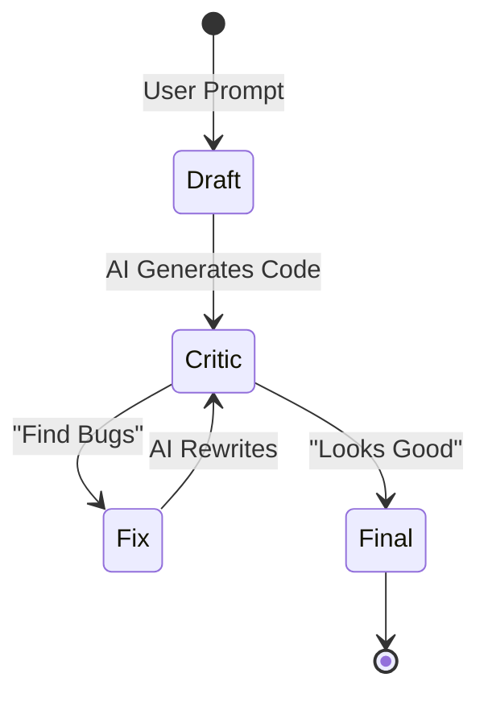

# Week 5 - Day 1: AI for Python Automation

## Overview
**Week 5 – Day 1**
**Topic:** Generating Beginner-Friendly Python Scripts with AI
**Duration:** ~60 minutes

### Learning Objectives
By the end of this lesson, you will be able to:
1. Use AI (Generator Pattern) to draft simple Python scripts for everyday tasks.
2. Specify libraries in your prompts to ensure correct, working syntax.
3. Use the Critic Pattern to debug and improve AI-generated code.

---

## 🚦 Prerequisite Checklist
Before starting this week, it helps (but isn't required!) to be a little familiar with:
- **Variables & Data Types**: Text, numbers, lists, and simple key-value pairs.
- **Control Flow**: The basic idea of "if this, then that" and "repeat this for each item."
- **Environment**: Having Python installed on your computer (or using a free online option like Replit).

> [!TIP]
> Brand new to Python? No problem! Ask the **AI Tutor** (bottom right) for a "5-minute Python refresher for complete beginners" before proceeding.

---

## Lesson Content

### The "Enthusiastic Helper" Analogy

Think of AI as an enthusiastic helper who knows the syntax of Python perfectly, but doesn't know the specifics of *your* project until you tell it.
- **Good at:** "How do I read a list of expenses from a CSV file in Python?"
- **Bad at:** "Automate my life." (Too vague).

### Prompting for File Organization

**Scenario:** Your Downloads folder is a mess of PDFs, images, and random files. You want a script to sort them into folders.

**The Bad Prompt:**
"Write a python script to organize my files."

**The Good Prompt (PCTF):**
> **Persona:** Friendly Python tutor.
> **Task:** Write a script that organizes files in a folder into subfolders by file type (Images, Documents, Others).
> **Steps:**
> 1. Look at every file in a given folder.
> 2. Check the file extension.
> 3. Move it into a matching subfolder, creating the subfolder if it doesn't exist.
> **Constraint:** Add comments explaining each step, since I'm a beginner.

**The Output:**
The AI will generate a script using the built-in `os` and `shutil` modules with clear comments explaining each part.

### Prompting for APIs (Requests)

**Scenario:** You want to build a tiny tool that checks today's weather for your city.

**The Prompt:**
> **Task:** Python script to get today's weather for a city.
> **Library:** `requests` module, using a free weather API.
> **Output:** Print the temperature and a short description in plain English.

### The "Explain Code" Pattern

You find a script online or a friend shares one. You don't fully understand it.
**Prompt:** "Explain this code line-by-line, in plain English, like I'm brand new to Python. What does the `for` loop on line 5 actually do?"

### Visualizing the Workflow

---

## Hands-On Exercise

### Exercise: The "Expense Tracker" Script

**Objective:** Use AI to build a small, working tool.

**Step 1: The Draft**
> **Prompt:** "Write a Python script that reads a list of expenses (each with a category and amount) and prints the total spent per category."

**Step 2: The Audit (Critic)**
> **Prompt:** "Review the code above. What happens if the amount is entered as text instead of a number by mistake? What happens if the list is empty? Rewrite to handle these situations gracefully."

*(Recall the **Critic Pattern** from Week 4? We are applying that same logic here to catch bugs before running the code.)*

**Step 3: The Dry Run**
(Mental Check): Does the script handle each category correctly? Does it look right?

**Reflection:**
You "wrote" a genuinely useful script in a few minutes. Your job wasn't typing every line; it was *specifying what you needed* and *reviewing the result*.

---

## Interactive Daily Quiz

### Question 1 (Library)
**You want your Python script to fetch data from a website's API (like a weather service). Which library should you ask the AI to use?**

A) Pandas
B) requests
C) TensorFlow
D) React

**Correct Answer:** B

**Feedback:**
- **B) ✓ Correct!** The `requests` library is the standard, beginner-friendly way to call web APIs in Python.

### Question 2 (Constraints)
**Why should you specify "Handle unexpected input gracefully" in your prompt?**

A) To make the code look cool.
B) Because AI often writes "Happy Path" code (assuming everything goes perfectly). Real-world use has typos and edge cases.
C) It saves memory.
D) It is required by Python.

**Correct Answer:** B

**Feedback:**
- **B) ✓ Correct!** Reliable code needs to handle mistakes and edge cases. AI defaults to simple code unless asked otherwise.

### Question 3 (Security)
**The AI generates a script with your actual email password hardcoded directly in the code. What do you do?**

A) Run it as-is.
B) Use the Critic Pattern: "Rewrite this to read the password from a secure input or environment variable. Never hardcode credentials."
C) Post it publicly online.
D) Ignore it.

**Correct Answer:** B

**Feedback:**
- **B) ✓ Correct!** Hardcoded credentials are a major security risk, even in a small personal script.

### Question 4 (Debugging)
**You get an error: `ModuleNotFoundError: No module named 'requests'`. What do you ask the AI?**

A) "Fix it."
B) "How do I install the missing dependency for this script?"
C) "Why is Python broken?"
D) "Switch me to a different programming language."

**Correct Answer:** B

**Feedback:**
- **B) ✓ Correct!** It will tell you to run `pip install requests` in your terminal.

### Question 5 (Workflow)
**The "Generator -> Critic -> Fix" loop applied to code is often called:**

A) The Infinite Loop.
B) Pair Programming (with AI).
C) A crash.
D) Testing.

**Correct Answer:** B

**Feedback:**
- **B) ✓ Correct!** You act as the reviewer, AI acts as the drafter. Together you write better code.

---

### Summary
Today you unlocked the power of **Code Generation**. You learned that you don't need to memorize every Python function—you just need to know *what to ask for*. Tomorrow, we apply this to everyday **spreadsheets and macros**.
