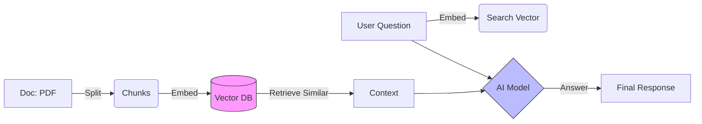

# Week 6 - Day 3: Intro to RAG (Chat with Data)

## Overview
**Week 6 – Day 3**  
**Topic:** Retrieval Augmented Generation (RAG) Concepts  
**Duration:** ~60 minutes  

### Learning Objectives
By the end of this lesson, you will be able to:
1. Define **RAG** (Retrieval Augmented Generation).
2. Explain why AI models need RAG to answer questions about *your* private or personal data.
3. Understand the "Vector Database" concept (roughly).

---

## Lesson Content

### The Problem: The "Cutoff Date" and Privacy

A general AI model knows a lot about the public internet up to its training date.
It knows **Nothing** about:
- Your company's actual employee handbook.
- Your personal budget spreadsheet.
- The meeting notes you wrote yesterday.

If you paste all that data into a single prompt, you can quickly run out of **Context Window** space, especially with a big document.

### The Solution: RAG

**RAG** is like an open-book test.
1.  **User Question:** "How many sick days do I get per year?"
2.  **Retrieval (Search):** The system searches your handbook document for "sick days."
3.  **Augmentation (Context):** It finds a paragraph: *"Employees receive 8 paid sick days per year."*
4.  **Generation (Answer):** It sends the Question + The Found Paragraph to the AI model.
    - *Prompt:* "Using the context 'Employees receive 8 paid sick days per year', answer 'How many sick days do I get?'"
5.  **AI Answer:** "You get 8 paid sick days per year."

The AI didn't already "know" this fact. It "read" it from the context provided by the search.

### Vector Search (The Magic Index)

How does it find the right paragraph out of thousands of pages without relying on exact keyword matches?
It uses **Vectors** (Lists of numbers called **Embeddings**).

> [!TIP]
> **Analogy: Map Coordinates for Meaning**
> Imagine giving every word or sentence a set of map coordinates based on its *meaning*, the way a city address has coordinates based on its physical location.
> - Words with similar meaning end up sitting right next to each other on the map (e.g., *"sick leave"* and *"doctor's note"* sit in the same neighborhood).
> - Because meaning is converted into math coordinates, AI can perform logic like `"King" - "Man" + "Woman" ≈ "Queen"`.
> 
> When you ask a question, the system converts your prompt into coordinates and retrieves the paragraphs whose coordinates sit closest to yours — even if you didn't use the exact same words!

> [!IMPORTANT]
> **Ethics Checkpoint: Data Privacy & Contextual Accuracy**
> RAG allows you to use private or personal data, but it introduces new risks:
> - **Data Storage**: Where is your document data actually stored? If you use a cloud-based tool, your personal or company documents are now on someone else's server.
> - **Retrieval Gaps**: If the search system only finds *half* of a relevant policy or fact, the AI will generate a half-true (and potentially misleading) answer. You are responsible for checking that the search results are actually comprehensive.

> [!CAUTION]
> **Ethics Checkpoint: The Accountability Gap**
> If your RAG bot retrieves an outdated document and confidently tells someone the wrong policy or instruction, **who is responsible?**
> - The AI model itself? No.
> - The software developer of the tool? Unlikely.
> - **You (The Builder)**: You are responsible for keeping the source documents current. If your documentation is stale, your bot becomes a liability rather than an asset.

### Visualizing RAG

---

## Hands-On Exercise

### Exercise: The RAG Architect

**Objective:** design the flow for a "Policy Bot."

**Scenario:** You have a 50-page Employee Handbook PDF.
**Flow:**
1.  **Ingest:** Split PDF into chunks (paragraphs). Save to a Vector Database.
2.  **User:** "Can I wear shorts to work?"
3.  **Retrieve:** System finds chunk: *"Dress code requires business casual. Shorts are not permitted."*
4.  **Generate:** AI says: "According to the handbook, shorts are not permitted since business casual is required."

**Reflection:**
Without RAG, the AI would guess (and potentially hallucinate) or say "I don't know." With RAG, it answers accurately based on *your* actual document.

---

## Interactive Daily Quiz

### Question 1 (Acronym)
**What does RAG stand for?**

A) Really Advanced GPT.
B) Retrieval Augmented Generation.
C) Random Access Generator.
D) Red Amber Green.

**Correct Answer:** B

**Feedback:**
- **B) ✓ Correct!** Retrieve Data -> Augment Prompt -> Generate Answer.

### Question 2 (Necessity)
**Why not just retrain the model on your documents instead of using RAG?**

A) Retraining is expensive, slow, and hard to keep updated. RAG is quicker to set up and cheaper to update.
B) Retraining makes the model dumber.
C) You can't retrain models at all.
D) RAG is always harder to build.

**Correct Answer:** A

**Feedback:**
- **A) ✓ Correct!** RAG is generally preferred for personal or company knowledge because you can just add a new document to "update" the knowledge instantly.

### Question 3 (Limits)
**If the answer is NOT in the documents provided, what should a well-built RAG system do?**

A) Make something up.
B) Say "I cannot find that information in the provided documents."
C) Search the open internet instead without telling you.
D) Crash.

**Correct Answer:** B

**Feedback:**
- **B) ✓ Correct!** This reduces hallucinations. "If it's not in the source, don't guess."

### Question 4 (Component)
**What is the database called that stores the text "Embeddings" (numbers representing meaning)?**

A) A regular spreadsheet.
B) A Vector Database.
C) A photo album.
D) A calendar app.

**Correct Answer:** B

**Feedback:**
- **B) ✓ Correct!** Specialized for similarity search based on meaning, not just exact words.

### Question 5 (Analogy)
**RAG is like:**

A) Taking a test purely from memory.
B) Taking an open-book test, where you look up the answer in the textbook before writing it down.
C) Copying a friend's answers.
D) Guessing randomly.

**Correct Answer:** B

**Feedback:**
- **B) ✓ Correct!** The system "looks up" the relevant info first, before answering.

---

### Summary
Today you conceptually understood **RAG**. It is the bridge between the "Brain" (the AI model) and "Your Facts" (your own documents). Tomorrow, we build one.
