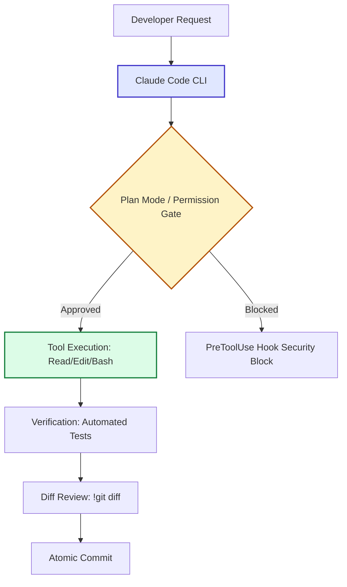

# Week 6 - Day 5: Asynchronous Cloud Sandboxes on claude.ai/code

## Overview
**Week 6 – Day 5**  
**Topic:** Asynchronous Cloud Sandboxes on claude.ai/code  
**Duration:** ~90 minutes  
**Difficulty:** Advanced

### Learning Objectives
By the end of this lesson, you will be able to:
1. Explain the underlying architecture and protocol mechanics of asynchronous cloud sandboxes on claude.ai/code.
2. Execute step-by-step terminal workflows using official Claude Code commands.
3. Prevent common operational antipatterns and token cost regressions.
4. Verify code changes and tool outputs with automated test assertions.
5. Apply production-grade security and context hygiene practices.

---

## Lesson Content

### Conceptual Breakdown

Dispatch long-running refactoring tasks to hosted cloud environments.

In professional agentic software engineering, executing tasks with Claude Code requires understanding both the conversational interface and the underlying file/process execution sandbox.



### Key Technical Commands

```bash
Teleport session from CLI to claude.ai/code and back
```

### Operational Rules & Pro-Tips

> [!TIP]
> **Production Best Practice:** Always review diffs natively before accepting changes. Use `!git diff` in interactive sessions to review code changes at zero token cost.

> [!WARNING]
> **Security Guardrail:** Never run untrusted hooks or plugins without inspecting their source scripts. Hooks execute with your full local user permissions.

### Common Antipatterns to Avoid

| Antipattern | Why It Fails | Recommended Solution |
| :--- | :--- | :--- |
| Unstructured Prompting | Produces bloated diffs with unintended side effects | Enter Plan Mode (`Shift+Tab`) and review the step-by-step file plan first |
| Leaving Unused MCPs Active | Injects heavy tool schemas into every turn | Disconnect idle MCP servers with `claude mcp remove` |
| Monolithic Prompts | Dilutes instruction adherence | Break large tasks into focused atomic iterations |

---

## Practical Exercise & Lab Instructions

1. Launch your interactive terminal session in your project root:
   ```bash
   claude
   ```
2. Follow the specific exercise drill for today's topic:
   ```bash
   Teleport session from CLI to claude.ai/code and back
   ```
3. Run the automated test suite to verify zero regressions:
   ```bash
   npm test || pytest
   ```
4. Review the final diff:
   ```bash
   !git diff
   ```

---

## Knowledge Check & Mini-Quiz

1. **What is the primary benefit of today's core technique?**
   - It establishes deterministic, repeatable, and verified AI-assisted engineering workflows.
2. **What command validates execution without LLM token cost?**
   - Native shell commands prefixed with `!` (e.g. `!git diff`, `!git status`).
