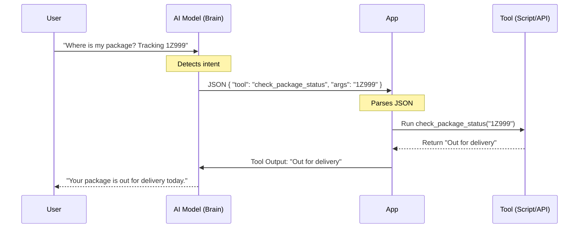

# Week 7 - Day 1: The "Action" Layer (Function Calling)

## Overview
**Week 7 – Day 1**  
**Topic:** Introduction to Function Calling (Tools)  
**Duration:** ~60 minutes  

### Learning Objectives
By the end of this lesson, you will be able to:
1. Define **Function Calling** (Tool Use) in the context of AI models.
2. Explain how a chatbot "decides" to take an action.
3. Distinguish between "Chat" (Conversation) and "Action" (Execution).

---

## Lesson Content

### The Limitation of Chat

Until now, your bots have been **Passive Talkers**.
- User: "Where's my package?"
- Bot: "I cannot check that. Please visit the tracking website."

To make them **Active Doers**, we need **Function Calling**.

### How It Works

Function Calling is not magic. It's a specific Prompt & JSON handshake.

**The "Under the Hood" Analogy:**
Remember the wire connecting two nodes in a visual flow builder (Week 6)? That wire isn't just a line; it carries data. In code, that wire is a **JSON Object**. Function calling is just manually writing that connection payload.

1.  **The Definitions:** You give the bot a list of "Tools" in the System Prompt.
    - `check_package_status(tracking_number)`
    - `find_store_hours(location)`
2.  **The Trigger:**
    - User: "My tracking number is 1Z999, where is my package?"
3.  **The Decision:**
    - The AI detects intent.
    - It does *not* reply with plain text.
    - It replies with structured JSON: `{"tool": "check_package_status", "args": {"tracking_number": "1Z999"}}`.
4.  **The Execution:**
    - The Application (your low-code tool or Python app) sees this JSON, runs the actual lookup, and feeds the result back to the AI.
5.  **The Response:**
    - AI: "Your package is currently out for delivery and should arrive today."

### Visualizing the Flow



### The "Hands" of the AI

Think of the AI model as the **Brain**.
Think of the Tools (APIs) as the **Hands**.
Function Calling is the nerve signal from Brain to Hands.

> [!NOTE]
> **A Quick Bridge: What is an API?**
> We'll unpack APIs in full detail tomorrow (Day 2). For now, simply think of an **API** (Application Programming Interface) as a digital button or counter window that lets one software tool send a request to another tool and get an answer back.

---

## Hands-On Exercise

### Exercise: The Tool Definer

**Objective:** Write a "Tool Definition" for a hypothetical function.

**Scenario:** You have a script `find_library_book(title)` that checks if a book is available at your local library.

**Task:** Write the JSON schema that tells the AI how to use it.

**Solution:**
```json
{
  "name": "find_library_book",
  "description": "Checks whether a book is currently available at the local library. Use this when the user asks if a book can be borrowed or is in stock.",
  "parameters": {
    "type": "object",
    "properties": {
      "title": {
        "type": "string",
        "description": "The title of the book to search for (e.g., 'The Hobbit')"
      }
    },
    "required": ["title"]
  }
}
```

**Reflection:**
If you don't describe the tool well ("description"), the AI won't know *when* to use it.

---

## Interactive Daily Quiz

### Question 1 (Concept)
**What is "Function Calling" in AI?**

A) Calling a support phone number.
B) The ability of an AI model to output a structured command (JSON) to run a specific code function instead of standard text.
C) Writing Python functions by hand.
D) A video call.

**Correct Answer:** B

**Feedback:**
- **B) ✓ Correct!** It enables the AI to interact with external systems, not just talk about them.

### Question 2 (Mechanism)
**Does the AI actually run the code itself?**

A) Yes, it runs code internally on its own.
B) No. It outputs text (JSON) requesting the code be run. The hosting application runs the actual code.
C) Yes, because it's a computer.
D) Sometimes, depending on the day.

**Correct Answer:** B

**Feedback:**
- **B) ✓ Correct!** The AI is a text-in/text-out engine. It triggers the action, but doesn't execute it directly.

### Question 3 (Prompting)
**Where do you define the available tools?**

A) In the user's message.
B) In a special "Tools" definition passed alongside the request.
C) In an email.
D) You don't need to define them.

**Correct Answer:** B

**Feedback:**
- **B) ✓ Correct!** Most AI providers have a specific way to pass in a list of available tools.

### Question 4 (Error Handling)
**If the Tool fails (e.g., the package tracking service is down), what happens?**

A) The bot crashes permanently.
B) The error message is fed back to the AI, which can then explain the issue or apologize to the user.
C) The bot laughs.
D) Nothing happens at all.

**Correct Answer:** B

**Feedback:**
- **B) ✓ Correct!** This feedback loop allows for graceful handling of failures.

### Question 5 (Safety)
**Should you give an AI a tool called `delete_all_orders()`?**

A) Yes, it's powerful and convenient.
B) No! Only give AI tools that are safe to run, or that require a human confirmation step first.
C) Only on weekends.
D) Yes, if you ask nicely.

**Correct Answer:** B

**Feedback:**
- **B) ✓ Correct!** The principle of "least privilege" applies to AI actions just as much as to human permissions.

---

### Summary
Today you learned how to give your bot **Hands**. Function Calling transforms AI from a "Know-It-All" to a "Do-It-All." Tomorrow, we connect these hands to real APIs.
