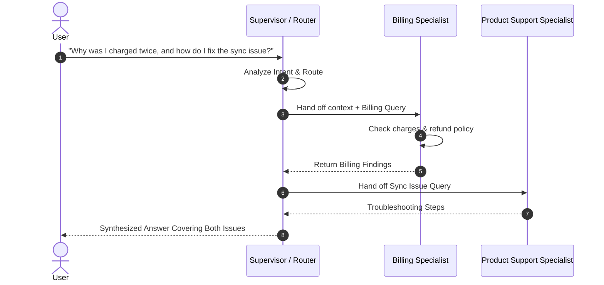

# Week 7 - Day 4: Multi-Agent Patterns & Orchestration

## Overview
**Week 7 – Day 4**
**Topic:** Multi-Agent Systems (Supervisor/Worker Pattern)
**Duration:** ~60 minutes

### Learning Objectives
By the end of this lesson, you will be able to:
1. Define **Multi-Agent Architecture** and explain when to transition from single-agent to multi-agent.
2. Explain the **Supervisor/Worker** pattern and state propagation.
3. Build a "Routing Agent" that delegates tasks to specialist sub-agents.
4. Implement context preservation during multi-agent handoffs.

---

## Lesson Content

### Why Multiple Agents?

A single AI agent assigned to handle billing questions, product support, and appointment scheduling all at once often suffers from **context pollution** and **prompt degradation**. As system instructions grow longer and cover more ground, the AI loses focus on specific constraints for any one task.

**Specialization** improves performance dramatically by partitioning responsibilities:
- **Supervisor (Router) Agent:** Analyzes user intent, delegates work, and synthesizes final responses.
- **Billing & Payments Agent:** Specializes in invoices, refunds, and payment methods.
- **Product Support Agent:** Specializes in how-to questions and troubleshooting.
- **Scheduling Agent:** Focuses strictly on booking, rescheduling, and cancelling appointments.

### The Supervisor Pattern

The **Supervisor Pattern** introduces a central manager that acts as the traffic controller:



### State Handoff & Context Propagation

In multi-agent architectures, the primary technical challenge is **State Handoff**. When the Supervisor delegates to a Specialist, it must decide what context to pass:

1. **Full History Transfer:** Sends the entire conversation thread. High token cost, risk of context pollution.
2. **Selective State Handoff:** Extracts only the relevant variables (e.g., Customer ID, Order Number, Issue Type) into a structured payload.
3. **Shared Memory Store:** Uses a centralized key-value store where agents read and write shared state.

#### Python Multi-Agent Router Example:

```python
from typing import Dict, Any

class SupportOrchestrator:
    def __init__(self, router_agent, billing_agent, support_agent):
        self.router = router_agent
        self.specialists = {
            "billing": billing_agent,
            "support": support_agent
        }

    def process_request(self, user_prompt: str) -> Dict[str, Any]:
        # Step 1: Supervisor classifies intent
        intent = self.router.classify(user_prompt)  # e.g., "billing"

        # Step 2: Extract structured state
        state_payload = {
            "original_query": user_prompt,
            "target_category": intent,
            "timestamp": "2026-07-29T16:00:00Z"
        }

        # Step 3: Delegate to sub-agent
        if intent in self.specialists:
            result = self.specialists[intent].execute(state_payload)
            return {"status": "success", "agent": intent, "response": result}

        return {"status": "fallback", "response": "General customer service response."}
```

---

## Hands-On Exercise

### Exercise: The "Small Business Support" Multi-Agent Simulator

**Objective:** Design a supervisor routing matrix for a small online shop's customer service.

**Agents Configuration:**
1. **Billing & Payments Bot:** Specializes in charges, refunds, and payment methods.
2. **Shipping & Returns Bot:** Handles delivery tracking, exchanges, and return labels.
3. **Supervisor Agent:** Inspects inbound messages and routes dynamically.

**Routing Rules Matrix:**

| User Keywords / Intent | Primary Target | Shared State Passed |
|------------------------|----------------|--------------------|
| `charge`, `refund`, `payment`, `invoice` | Billing & Payments Bot | `customer_id`, `order_id` |
| `shipping`, `return`, `exchange`, `tracking` | Shipping & Returns Bot | `order_id`, `carrier` |

**Sample Execution Walkthrough:**
- **Inbound Message:** "I was charged twice for order #5521 and I never got a shipping confirmation."
- **Supervisor Analysis:** Keywords `charged twice` -> Route to **Billing & Payments Bot**. Keywords `shipping confirmation` -> also route to **Shipping & Returns Bot**.
- **Sub-Agent Response:** Billing bot checks for duplicate charges; shipping bot checks tracking status. Supervisor combines both into one reply.

---

## Interactive Daily Quiz

### Question 1 (Architecture)
**What is the primary role of the "Supervisor" in a Multi-Agent system?**

A) To execute all tasks directly without delegating anything
B) To analyze user intent, route tasks to specialized sub-agents, and combine the results
C) To bypass rate limits by making duplicate requests
D) To permanently store logs without user visibility

**Correct Answer:** B

**Feedback:**
- **B) ✓ Correct!** The Supervisor acts as an orchestrator/router that manages intent classification and delegation to specialist agents.

### Question 2 (Benefit)
**Why is splitting a complex workflow into multiple specialized agents beneficial?**

A) It reduces overall system cost regardless of task complexity
B) Specialization reduces context pollution and mistakes by giving each agent a focused system prompt and restricted tools
C) It eliminates the need for system prompts entirely
D) Multi-agent systems always run faster than a single AI call

**Correct Answer:** B

**Feedback:**
- **B) ✓ Correct!** Focused system prompts and isolated tool sets lower error rates and prevent instructions from conflicting.

### Question 3 (Structure)
**Can a sub-agent maintain its own dedicated set of tools?**

A) Yes. For example, a Billing Agent may have a `check_charges` tool while a Shipping Agent has a `track_package` tool
B) No. Tools can only be defined globally at the Supervisor level
C) No. Sub-agents are restricted to plain-text output with zero tool access
D) Yes, but only if all tools are written in the same programming language

**Correct Answer:** A

**Feedback:**
- **A) ✓ Correct!** Modular tool assignment ensures sub-agents only access the tools required for their specific domain.

### Question 4 (State Management)
**Which state handoff strategy best prevents context pollution during agent transfers?**

A) Passing the entire chat history with every request
B) Extracting only relevant variables into a structured payload (Selective State Handoff)
C) Clearing all conversation history without passing any data
D) Hardcoding static responses in the router

**Correct Answer:** B

**Feedback:**
- **B) ✓ Correct!** Selective State Handoff keeps prompt size compact and focused on what's actually needed.

### Question 5 (Trade-offs)
**When should you NOT use a Multi-Agent architecture?**

A) When the domain covers multiple unrelated topics
B) When the task is simple and single-step, where multi-agent orchestration adds unnecessary complexity
C) When different tasks need different tool access
D) When using function calling

**Correct Answer:** B

**Feedback:**
- **B) ✓ Correct!** Avoid over-engineering. Simple tasks are best handled by a single, well-prompted agent.

---

### Summary
Today you mastered **Multi-Agent Orchestration**. You learned how the Supervisor/Worker pattern separates concerns, prevents prompt degradation, and how to manage state transfer between specialist agents. Tomorrow, we combine these concepts into a mini capstone project.
